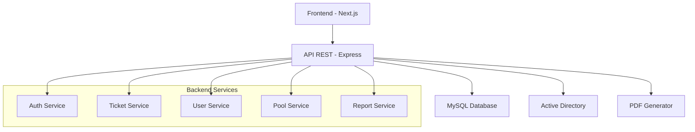

# Zelos

## Sistema de Chamados - Escola SENAI Armando de Arruda Pereira

Sistema completo para gerenciamento de chamados de manutenção, apoio técnico e outros serviços, desenvolvido especificamente para a Escola SENAI Armando de Arruda Pereira. O sistema utiliza números de patrimônio como identificadores únicos dos equipamentos.


---

## 📋 Índice

- [Sobre o Projeto](#-sobre-o-projeto)
- [Tecnologias](#-tecnologias)
- [Arquitetura](#-arquitetura)
- [Instalação](#-instalação)
- [Configuração](#-configuração)
- [Estrutura do Projeto](#-estrutura-do-projeto)
- [API Documentation](#-api-documentation)
- [Banco de Dados](#-banco-de-dados)
- [Autenticação](#-autenticação)
- [Desenvolvimento](#-desenvolvimento)
- [Contribuição](#-contribuição)

---

## 🎯 Sobre o Projeto

O Zelos é uma solução completa para gerenciamento de chamados técnicos em ambiente educacional, permitindo:

### ✨ Funcionalidades Principais

- **🎫 Gestão de Chamados**: Criação, acompanhamento e resolução de solicitações
- **👥 Controle de Usuários**: Sistema de roles (Admin, Técnico, Usuário)
- **⏱️ Apontamentos**: Registro detalhado do tempo gasto em cada atendimento
- **📊 Relatórios**: Geração de PDFs com histórico completo
- **🏷️ Pool de Serviços**: Categorização e especialização por tipo de atendimento
- **🔐 Integração AD**: Autenticação via Active Directory da SENAI

---

## 🛠️ Tecnologias

### Backend
- **Node.js** - Runtime JavaScript
- **Express.js** - Framework web
- **MySQL** - Banco de dados relacional
- **JWT** - Autenticação por tokens
- **bcryptjs** - Criptografia de senhas
- **PDFKit** - Geração de relatórios

### Frontend
- **Next.js** - Framework React
- **React** - Biblioteca de UI
- **Tailwind CSS** - Framework CSS

### DevOps
- **Docker** - Containerização
- **Git** - Controle de versão

---

## 🏗️ Arquitetura



### Padrão Arquitetural
- **MVC**: Model-View-Controller
- **Services**: Camada de lógica de negócio
- **Middlewares**: Autenticação e validação
- **Routes**: Endpoints da API REST

---

## 🚀 Instalação

### Pré-requisitos
- **Node.js** >= 14.x
- **MySQL** >= 8.0
- **Git**
- **npm** ou **yarn**

### 1. Clone o Repositório
```bash
git clone https://github.com/libre917/Zelos.git
cd Zelos
```

### 2. Instale as Dependências
```bash
# Instalar dependências do backend e frontend
npm run install

# Ou instalar separadamente
cd backend && npm install
cd ../frontend && npm install
```

### 3. Configure o Banco de Dados
```sql
-- Criar banco de dados
CREATE DATABASE zelos CHARACTER SET utf8mb4 COLLATE utf8mb4_unicode_ci;
USE zelos;

-- Executar script de inicialização
SOURCE bd/init.sql;
```

---

## ⚙️ Configuração

### Variáveis de Ambiente

#### Backend (`.env`)
```env
# Database Configuration
DB_HOST=localhost
DB_USER=root
DB_PASSWORD=sua_senha_aqui
DB_NAME=zelos

# JWT Secret
JWT_SECRET=sua_chave_secreta_super_segura_aqui

# Application
PORT=8080
FRONTEND_URL=http://localhost:3000

# Active Directory (Opcional)
AD_URL=ldap://10.189.87.7:389
AD_BASE_DN=ou=Funcionarios,ou=Usuarios123,dc=educ123,dc=sp,dc=senai,dc=br
```

#### Frontend (`.env.local`)
```env
NEXT_PUBLIC_API_URL=http://localhost:8080
```

### Inicialização dos Serviços

```bash
# Backend
npm run startBack
# Servidor rodando em http://localhost:8080

# Frontend  
npm run startFront
# Interface disponível em http://localhost:3000
```

### Usuário Padrão
O sistema cria automaticamente um usuário administrador:
- **Email**: `admin@email.com`
- **Senha**: `admin@123`

---

## 📁 Estrutura do Projeto

```
zelos/
├── 📂 backend/                    # Servidor Node.js
│   ├── 📂 config/                 # Configurações
│   │   ├── database.js            # Conexão MySQL
│   │   └── dotenv.js              # Variáveis ambiente
│   ├── 📂 controllers/            # Controladores
│   │   ├── AuthController.js      # Autenticação
│   │   ├── TicketsController.js   # Chamados
│   │   ├── UsersController.js     # Usuários
│   │   ├── PoolController.js      # Categorias
│   │   └── ReportController.js    # Relatórios
│   ├── 📂 services/               # Lógica de negócio
│   │   ├── ticketsService.js
│   │   ├── usersService.js
│   │   ├── poolService.js
│   │   └── reportsService.js
│   ├── 📂 models/                 # Modelos de dados
│   │   ├── User.js
│   │   ├── Ticket.js
│   │   ├── Pool.js
│   │   └── Report.js
│   ├── 📂 routes/                 # Rotas da API
│   ├── 📂 middlewares/            # Middlewares
│   └── 📂 utils/                  # Utilitários
├── 📂 frontend/                   # Interface Next.js
│   ├── 📂 app/                    # Páginas da aplicação
│   │   ├── 📂 admin/              # Área administrativa
│   │   ├── 📂 tecnico/            # Área do técnico
│   │   └── 📂 usuario/            # Área do usuário
│   ├── 📂 components/             # Componentes React
│   └── 📂 services/               # Serviços frontend
└── 📂 bd/                         # Scripts de banco
    ├── init.sql                   # Inicialização
    └── Dockerfile                 # Container MySQL
```

---

## 🔌 API Documentation

### Autenticação
| Método | Endpoint | Descrição |
|--------|----------|-----------|
| POST | `/auth/login` | Login do usuário |
| POST | `/auth/logout` | Logout do usuário |
| GET | `/auth/check-auth` | Verificar autenticação |

### Chamados
| Método | Endpoint | Descrição |
|--------|----------|-----------|
| GET | `/ticket` | Listar todos os chamados |
| GET | `/ticket/:id` | Obter chamado específico |
| GET | `/ticket/info/user` | Chamados do usuário logado |
| GET | `/ticket/info/tecnico` | Chamados do técnico logado |
| POST | `/ticket` | Criar novo chamado |
| PUT | `/ticket/:id/tecnico` | Atribuir técnico |
| PUT | `/ticket/:id/tecnico/resolve` | Resolver chamado |

### Usuários
| Método | Endpoint | Descrição |
|--------|----------|-----------|
| GET | `/users` | Listar usuários |
| GET | `/users/me/info` | Dados do usuário logado |
| GET | `/users/me/role` | Função do usuário logado |
| POST | `/users` | Criar usuário |
| POST | `/users/tecnico` | Criar técnico |
| PUT | `/users/:id` | Atualizar usuário |
| PUT | `/users/:id/status` | Alterar status |

### Relatórios
| Método | Endpoint | Descrição |
|--------|----------|-----------|
| GET | `/report/:ticket_id/reports` | Apontamentos do chamado |
| POST | `/report/:ticket_id/reports` | Criar apontamento |
| GET | `/report/:ticket_id/pdf` | PDF do chamado |
| GET | `/report/record/pdf` | PDF de todos os chamados |

---

## 🗄️ Banco de Dados

### Principais Tabelas

#### `usuarios`
```sql
CREATE TABLE usuarios (
    id INT PRIMARY KEY AUTO_INCREMENT,
    nome VARCHAR(255) NOT NULL,
    email VARCHAR(255) UNIQUE NOT NULL,
    senha VARCHAR(255) NOT NULL,
    funcao ENUM('usuario','tecnico','admin') DEFAULT 'usuario',
    status ENUM('ativo','inativo') DEFAULT 'ativo',
    criado_em TIMESTAMP DEFAULT CURRENT_TIMESTAMP
);
```

#### `chamados`
```sql
CREATE TABLE chamados (
    id INT PRIMARY KEY AUTO_INCREMENT,
    titulo VARCHAR(255) NOT NULL,
    descricao TEXT NOT NULL,
    tipo_id INT,
    tecnico_id INT,
    usuario_id INT NOT NULL,
    status ENUM('pendente','em andamento','concluído') DEFAULT 'pendente',
    criado_em TIMESTAMP DEFAULT CURRENT_TIMESTAMP,
    FOREIGN KEY (tipo_id) REFERENCES pool(id),
    FOREIGN KEY (tecnico_id) REFERENCES usuarios(id),
    FOREIGN KEY (usuario_id) REFERENCES usuarios(id)
);
```

#### `apontamentos`
```sql
CREATE TABLE apontamentos (
    id INT PRIMARY KEY AUTO_INCREMENT,
    chamado_id INT NOT NULL,
    tecnico_id INT NOT NULL,
    descricao TEXT,
    comeco TIMESTAMP NOT NULL,
    fim TIMESTAMP NULL,
    duracao INT AS (TIMESTAMPDIFF(SECOND, comeco, fim)) STORED,
    criado_em TIMESTAMP DEFAULT CURRENT_TIMESTAMP,
    FOREIGN KEY (chamado_id) REFERENCES chamados(id),
    FOREIGN KEY (tecnico_id) REFERENCES usuarios(id)
);
```

---

## 🔐 Autenticação

### Sistema JWT
- **Expiração**: 1 dia
- **Armazenamento**: HTTP-only cookies
- **Middleware**: Validação automática em rotas protegidas

### Níveis de Acesso
- **👑 Admin**: Acesso completo ao sistema
- **🔧 Técnico**: Gerenciar chamados e apontamentos  
- **👤 Usuário**: Criar e acompanhar próprios chamados

### Integração Active Directory
```javascript
// Configuração LDAP para SENAI
const ldapConfig = {
    url: 'ldap://10.189.87.7:389',
    baseDN: 'ou=Funcionarios,ou=Usuarios123,dc=educ123,dc=sp,dc=senai,dc=br',
    filter: '(sAMAccountName={{username}})'
};
```

---

## 💻 Desenvolvimento

### Scripts Disponíveis
```bash
# Desenvolvimento
npm run dev          # Inicia ambos os serviços
npm run startBack    # Apenas backend
npm run startFront   # Apenas frontend

# Produção
npm run build        # Build do projeto
npm run start        # Iniciar produção

# Utilitários
npm run test         # Executar testes
npm run lint         # Verificar código
```

### Padrões de Código
- **ES6+**: Modules, async/await, destructuring
- **Error Handling**: Try-catch robusto com status HTTP
- **Validation**: Camada de validação consistente
- **Security**: Hash de senhas, JWT, sanitização

### Health Check
```bash
curl http://localhost:8080/health
# Response: {"status": "online"}
```

---

## 🚀 Deploy

### Docker
```bash
# Build da imagem
docker build -t zelos .

# Executar container
docker run -p 3000:3000 -p 8080:8080 zelos
```

### Variáveis de Produção
```env
NODE_ENV=production
DB_HOST=seu_host_producao
JWT_SECRET=chave_super_segura_producao
```

---

## 🤝 Contribuição

### Como Contribuir
1. Fork o projeto
2. Crie sua feature branch (`git checkout -b feature/NovaFuncionalidade`)
3. Commit suas mudanças (`git commit -m 'Adiciona nova funcionalidade'`)
4. Push para a branch (`git push origin feature/NovaFuncionalidade`)
5. Abra um Pull Request

### Padrões de Commit
```
feat: adiciona nova funcionalidade
fix: corrige bug específico
docs: atualiza documentação
style: formatação de código
refactor: refatoração de código
test: adiciona testes
```

---

## 📄 Licença

Este projeto está sob a licença **MIT**. Veja o arquivo [LICENSE](LICENSE) para detalhes.

---

## 👥 Equipe

- **Lucas Soalheiro** - *Desenvolvedor Backend*
- **Lucas Toledo** - *Desenvolvedor Frontend*  
- **Lucas Barberini** - *Arquiteto de Software*

---

## 📞 Suporte

Para dúvidas ou sugestões:
- 📧 Email: suporte@senai.br
- 🌐 Portal: [SENAI Armando de Arruda Pereira](https://senai.br)
- 📱 Issues: [GitHub Issues](https://github.com/libre917/Zelos/issues)

---

<div align="center">
  <p>Desenvolvido com ❤️ pela equipe SENAI</p>
  <p>© 2024 Escola SENAI Armando de Arruda Pereira</p>
</div>
