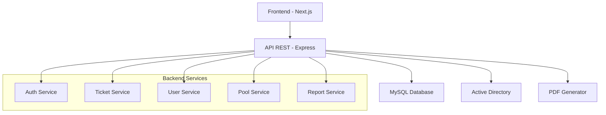
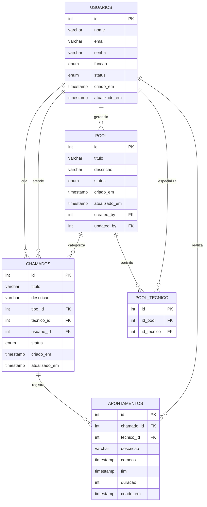

# Zelos

## Sistema de Chamados - Escola SENAI Armando de Arruda Pereira

Sistema completo para gerenciamento de chamados de manutenção, apoio técnico e outros serviços, desenvolvido especificamente para a Escola SENAI Armando de Arruda Pereira. O sistema utiliza números de patrimônio como identificadores únicos dos equipamentos.


---

## 📋 Índice

- [Sobre o Projeto](#-sobre-o-projeto)
- [Tecnologias](#-tecnologias)
- [Arquitetura](#-arquitetura)
- [Instalação](#-instalação)
- [Configuração](#-configuração)
- [Estrutura do Projeto](#-estrutura-do-projeto)
- [API Documentation](#-api-documentation)
- [Banco de Dados](#-banco-de-dados)
- [Autenticação](#-autenticação)
- [Desenvolvimento](#-desenvolvimento)
- [Contribuição](#-contribuição)

---

## 🎯 Sobre o Projeto

O Zelos é uma solução completa para gerenciamento de chamados técnicos em ambiente educacional, permitindo:

### ✨ Funcionalidades Principais

- **🎫 Gestão de Chamados**: Criação, acompanhamento e resolução de solicitações
- **👥 Controle de Usuários**: Sistema de roles (Admin, Técnico, Usuário)
- **⏱️ Apontamentos**: Registro detalhado do tempo gasto em cada atendimento
- **📊 Relatórios**: Geração de PDFs com histórico completo
- **🏷️ Pool de Serviços**: Categorização e especialização por tipo de atendimento
- **🔐 Integração AD**: Autenticação via Active Directory da SENAI

---

## 🛠️ Tecnologias

### Backend
- **Node.js** - Runtime JavaScript
- **Express.js** - Framework web
- **MySQL** - Banco de dados relacional
- **JWT** - Autenticação por tokens
- **bcryptjs** - Criptografia de senhas
- **PDFKit** - Geração de relatórios

### Frontend
- **Next.js** - Framework React
- **React** - Biblioteca de UI
- **Tailwind CSS** - Framework CSS

### DevOps
- **Docker** - Containerização
- **Git** - Controle de versão

---

## 🏗️ Arquitetura



### Padrão Arquitetural
- **MVC**: Model-View-Controller
- **Services**: Camada de lógica de negócio
- **Middlewares**: Autenticação e validação
- **Routes**: Endpoints da API REST

---

## 🚀 Instalação

### Pré-requisitos
- **Node.js** >= 14.x
- **MySQL** >= 8.0
- **Git**
- **npm** ou **yarn**

### 1. Clone o Repositório
```bash
git clone https://github.com/libre917/Zelos.git
cd Zelos
```

### 2. Instale as Dependências
```bash
# Instalar dependências do backend e frontend
npm run install

# Ou instalar separadamente
cd backend && npm install
cd ../frontend && npm install
```

### 3. Configure o Banco de Dados
```sql
-- Criar banco de dados
CREATE DATABASE zelos CHARACTER SET utf8mb4 COLLATE utf8mb4_unicode_ci;
USE zelos;

-- Executar script de inicialização
SOURCE bd/init.sql;
```

---

## ⚙️ Configuração

### Variáveis de Ambiente

#### Backend (`.env`)
```env
# Database Configuration
DB_HOST=localhost
DB_USER=root
DB_PASSWORD=sua_senha_aqui
DB_NAME=zelos

# JWT Secret
JWT_SECRET=sua_chave_secreta_super_segura_aqui

# Application
PORT=8080
FRONTEND_URL=http://localhost:3000
```

#### Frontend (`.env.local`)
```env
NEXT_PUBLIC_API_URL=http://localhost:8080 (A porta tem que estar de acordo com a porta do backend)
```

### Inicialização dos Serviços

```bash
# Backend
npm run startBack
# Servidor rodando em http://localhost:8080

# Frontend  
npm run startFront
# Interface disponível em http://localhost:3000
```

### Usuário Padrão
O sistema cria automaticamente um usuário administrador:
- **Email**: `admin@email.com`
- **Senha**: `admin@123`

---

## 📁 Estrutura do Projeto

```
zelos/
├── 📂 backend/                    # Servidor Node.js
│   ├── 📂 config/                 # Configurações
│   │   ├── database.js            # Conexão MySQL
│   │   └── dotenv.js              # Variáveis ambiente
│   ├── 📂 controllers/            # Controladores
│   │   ├── AuthController.js      # Autenticação
│   │   ├── TicketsController.js   # Chamados
│   │   ├── UsersController.js     # Usuários
│   │   ├── PoolController.js      # Categorias
│   │   └── ReportController.js    # Relatórios
│   ├── 📂 services/               # Lógica de negócio
│   │   ├── ticketsService.js
│   │   ├── usersService.js
│   │   ├── poolService.js
│   │   └── reportsService.js
│   ├── 📂 models/                 # Modelos de dados
│   │   ├── User.js
│   │   ├── Ticket.js
│   │   ├── Pool.js
│   │   └── Report.js
│   ├── 📂 routes/                 # Rotas da API
│   ├── 📂 middlewares/            # Middlewares
│   └── 📂 utils/                  # Utilitários
├── 📂 frontend/                   # Interface Next.js
│   ├── 📂 app/                    # Páginas da aplicação
│   │   ├── 📂 admin/              # Área administrativa
│   │   ├── 📂 tecnico/            # Área do técnico
│   │   └── 📂 usuario/            # Área do usuário
│   ├── 📂 components/             # Componentes React
│   └── 📂 services/               # Serviços frontend
└── 📂 bd/                         # Scripts de banco
    ├── init.sql                   # Inicialização
    └── Dockerfile                 # Container MySQL
```

---

## 🔌 API Documentation

### Autenticação
| Método | Endpoint | Descrição |
|--------|----------|-----------|
| POST | `/auth/login` | Login do usuário |
| POST | `/auth/logout` | Logout do usuário |
| GET | `/auth/check-auth` | Verificar autenticação |

### Chamados
| Método | Endpoint | Descrição |
|--------|----------|-----------|
| GET | `/ticket` | Listar todos os chamados |
| GET | `/ticket/:id` | Obter chamado específico |
| GET | `/ticket/info/user` | Chamados do usuário logado |
| GET | `/ticket/info/tecnico` | Chamados do técnico logado |
| POST | `/ticket` | Criar novo chamado |
| PUT | `/ticket/:id/tecnico` | Atribuir técnico |
| PUT | `/ticket/:id/tecnico/resolve` | Resolver chamado |

### Usuários
| Método | Endpoint | Descrição |
|--------|----------|-----------|
| GET | `/users` | Listar usuários |
| GET | `/users/me/info` | Dados do usuário logado |
| GET | `/users/me/role` | Função do usuário logado |
| POST | `/users` | Criar usuário |
| POST | `/users/tecnico` | Criar técnico |
| PUT | `/users/:id` | Atualizar usuário |
| PUT | `/users/:id/status` | Alterar status |

### Relatórios
| Método | Endpoint | Descrição |
|--------|----------|-----------|
| GET | `/report/:ticket_id/reports` | Apontamentos do chamado |
| POST | `/report/:ticket_id/reports` | Criar apontamento |
| GET | `/report/:ticket_id/pdf` | PDF do chamado |
| GET | `/report/record/pdf` | PDF de todos os chamados |

---

## 🗄️ Banco de Dados

### Principais Tabelas

#### `usuarios`
Armazena informações de todos os usuários do sistema (admins, técnicos e usuários comuns).

```sql
CREATE TABLE `usuarios` (
  `id` int(11) NOT NULL AUTO_INCREMENT,
  `nome` varchar(255) NOT NULL,
  `senha` varchar(255) NOT NULL,
  `email` varchar(255) NOT NULL,
  `funcao` enum('usuario','tecnico','admin') DEFAULT 'usuario',
  `status` enum('ativo','inativo') DEFAULT 'ativo',
  `criado_em` timestamp NULL DEFAULT current_timestamp(),
  `atualizado_em` timestamp NULL DEFAULT current_timestamp() ON UPDATE current_timestamp(),
  PRIMARY KEY (`id`),
  UNIQUE KEY `email` (`email`),
  KEY `idx_usuarios_email` (`email`)
) ENGINE=InnoDB DEFAULT CHARSET=utf8mb4 COLLATE=utf8mb4_unicode_ci;
```

#### `pool`
Define as categorias de serviços/tipos de chamados disponíveis no sistema.

```sql
CREATE TABLE `pool` (
  `id` int(11) NOT NULL AUTO_INCREMENT,
  `titulo` varchar(50) NOT NULL,
  `descricao` varchar(250) DEFAULT NULL,
  `status` enum('ativo','inativo') DEFAULT 'ativo',
  `criado_em` timestamp NULL DEFAULT current_timestamp(),
  `atualizado_em` timestamp NULL DEFAULT current_timestamp() ON UPDATE current_timestamp(),
  `created_by` int(11) DEFAULT NULL,
  `updated_by` int(11) DEFAULT NULL,
  PRIMARY KEY (`id`),
  KEY `created_by` (`created_by`),
  KEY `updated_by` (`updated_by`),
  CONSTRAINT `pool_ibfk_1` FOREIGN KEY (`created_by`) REFERENCES `usuarios` (`id`),
  CONSTRAINT `pool_ibfk_2` FOREIGN KEY (`updated_by`) REFERENCES `usuarios` (`id`)
) ENGINE=InnoDB DEFAULT CHARSET=utf8mb4 COLLATE=utf8mb4_unicode_ci;
```

#### `pool_tecnico`
Relacionamento many-to-many entre técnicos e categorias de serviços.

```sql
CREATE TABLE `pool_tecnico` (
  `id` int(11) NOT NULL AUTO_INCREMENT,
  `id_pool` int(11) DEFAULT NULL,
  `id_tecnico` int(11) DEFAULT NULL,
  PRIMARY KEY (`id`),
  KEY `id_pool` (`id_pool`),
  KEY `id_tecnico` (`id_tecnico`),
  CONSTRAINT `pool_tecnico_ibfk_1` FOREIGN KEY (`id_pool`) REFERENCES `pool` (`id`),
  CONSTRAINT `pool_tecnico_ibfk_2` FOREIGN KEY (`id_tecnico`) REFERENCES `usuarios` (`id`)
) ENGINE=InnoDB DEFAULT CHARSET=utf8mb4 COLLATE=utf8mb4_unicode_ci;
```

#### `chamados`
Registra todos os chamados/tickets do sistema.

```sql
CREATE TABLE `chamados` (
  `id` int(11) NOT NULL AUTO_INCREMENT,
  `titulo` varchar(255) NOT NULL,
  `descricao` varchar(250) DEFAULT NULL,
  `tipo_id` int(11) DEFAULT NULL,
  `tecnico_id` int(11) DEFAULT NULL,
  `usuario_id` int(11) DEFAULT NULL,
  `status` enum('pendente','em andamento','concluido') DEFAULT 'pendente',
  `criado_em` timestamp NULL DEFAULT current_timestamp(),
  `atualizado_em` timestamp NULL DEFAULT current_timestamp() ON UPDATE current_timestamp(),
  PRIMARY KEY (`id`),
  KEY `tipo_id` (`tipo_id`),
  KEY `tecnico_id` (`tecnico_id`),
  KEY `usuario_id` (`usuario_id`),
  KEY `idx_chamados_status` (`status`),
  CONSTRAINT `chamados_ibfk_1` FOREIGN KEY (`tipo_id`) REFERENCES `pool` (`id`),
  CONSTRAINT `chamados_ibfk_2` FOREIGN KEY (`tecnico_id`) REFERENCES `usuarios` (`id`),
  CONSTRAINT `chamados_ibfk_3` FOREIGN KEY (`usuario_id`) REFERENCES `usuarios` (`id`)
) ENGINE=InnoDB DEFAULT CHARSET=utf8mb4 COLLATE=utf8mb4_unicode_ci;
```

#### `apontamentos`
Registra os tempos e anotações dos técnicos durante o atendimento dos chamados.

```sql
CREATE TABLE `apontamentos` (
  `id` int(11) NOT NULL AUTO_INCREMENT,
  `chamado_id` int(11) DEFAULT NULL,
  `tecnico_id` int(11) DEFAULT NULL,
  `descricao` varchar(250) DEFAULT NULL,
  `comeco` timestamp NOT NULL DEFAULT current_timestamp() ON UPDATE current_timestamp(),
  `fim` timestamp NULL DEFAULT NULL,
  `duracao` int(11) GENERATED ALWAYS AS (timestampdiff(SECOND,`comeco`,`fim`)) STORED,
  `criado_em` timestamp NULL DEFAULT current_timestamp(),
  PRIMARY KEY (`id`),
  KEY `chamado_id` (`chamado_id`),
  KEY `tecnico_id` (`tecnico_id`),
  KEY `idx_apontamentos_comeco_fim` (`comeco`,`fim`),
  CONSTRAINT `apontamentos_ibfk_1` FOREIGN KEY (`chamado_id`) REFERENCES `chamados` (`id`),
  CONSTRAINT `apontamentos_ibfk_2` FOREIGN KEY (`tecnico_id`) REFERENCES `usuarios` (`id`)
) ENGINE=InnoDB DEFAULT CHARSET=utf8mb4 COLLATE=utf8mb4_unicode_ci;
```

### Relacionamentos do Banco



### Status e Enums

#### Status dos Chamados
- **`pendente`**: Chamado criado, aguardando atribuição de técnico
- **`em andamento`**: Técnico atribuído, trabalho em execução
- **`concluido`**: Chamado finalizado pelo técnico

#### Funções dos Usuários
- **`usuario`**: Usuário comum, pode criar e acompanhar seus chamados
- **`tecnico`**: Técnico especializado, pode atender chamados de sua categoria
- **`admin`**: Administrador, acesso completo ao sistema

#### Status de Usuários/Pools
- **`ativo`**: Disponível para uso no sistema
- **`inativo`**: Desabilitado temporariamente

### Scripts de Inicialização

#### Limpar e Recriar Banco
```bash
# Via linha de comando MySQL
cd bd/
mysql -u root -p < Dump20250902.sql
```

### Índices para Performance

O sistema implementa os seguintes índices otimizados:

```sql
-- Índices principais já incluídos no schema:
KEY `idx_usuarios_email` (`email`)           -- Login rápido
KEY `idx_chamados_status` (`status`)         -- Filtros por status
KEY `idx_apontamentos_comeco_fim` (`comeco`,`fim`) -- Cálculos de duração

-- Índices de chaves estrangeiras automaticamente criados
KEY `tipo_id` (`tipo_id`)
KEY `tecnico_id` (`tecnico_id`) 
KEY `usuario_id` (`usuario_id`)
KEY `chamado_id` (`chamado_id`)
```

---

## 🔐 Autenticação

### Sistema JWT
- **Expiração**: 1 dia
- **Armazenamento**: HTTP-only cookies
- **Middleware**: Validação automática em rotas protegidas

### Níveis de Acesso
- **👑 Admin**: Acesso completo ao sistema
- **🔧 Técnico**: Gerenciar chamados e apontamentos  
- **👤 Usuário**: Criar e acompanhar próprios chamados

---

## 💻 Desenvolvimento

### Scripts Disponíveis
```bash
npm run back   
npm run front 
```

### Padrões de Código
- **ES6+**: Modules, async/await, destructuring
- **Error Handling**: Try-catch robusto com status HTTP
- **Validation**: Camada de validação consistente
- **Security**: Hash de senhas, JWT, sanitização

### Health Check
```bash
curl http://localhost:8080/health
# Response: {"status": "online"}
```

---

## 👥 Equipe

- **Lucas Soalheiro** - *Desenvolvedor Backend*
- **Lucas Toledo** - *Desenvolvedor Frontend*  
- **Lucas Barberini** - *Arquiteto de Software*

---
<div align="center">
  <p>Desenvolvido pelos alunos do SENAI</p>
  <p>© 2025 Escola SENAI Armando de Arruda Pereira</p>
</div>
